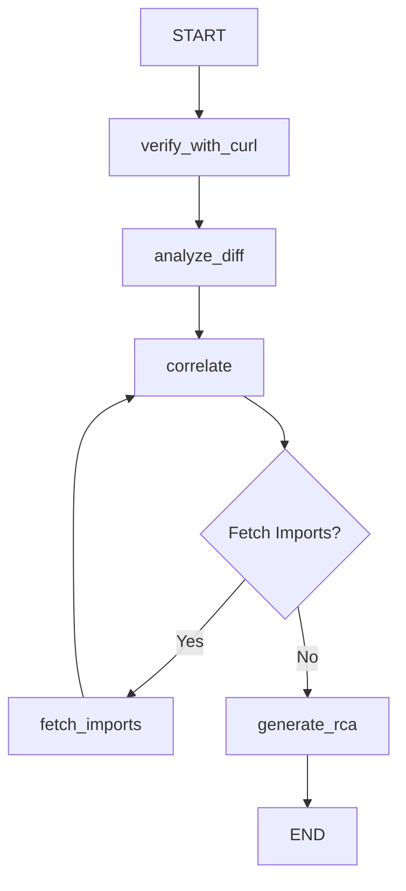
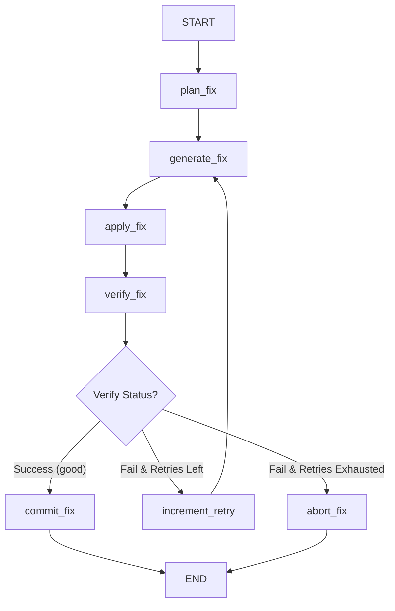

# PROJECT: git-bisect-fix

## Purpose
A Python CLI tool that automates the root cause analysis (RCA) and resolution of git regressions. Given a good commit, a bad commit, and a curl command, it:
1. Performs a programmatic `git bisect` to locate the faulty commit with zero LLM cost.
2. Orchestrates a LangGraph agent (Agent 1 - RCA) to retrieve file contexts, analyze the diff, and produce a structured root cause analysis report.
3. Gates the process with a blocking **Human Gate** terminal prompt.
4. Orchestrates a second LangGraph agent (Agent 2 - Fix) upon human approval to plan, generate, write, verify, and commit a bug fix on a new git branch.

---

## Stack
- **Python 3.11+**
- **LangGraph & LangChain** (Agent orchestration)
- **langchain-google-genai** (Google Gemini LLM provider)
- **Pydantic v2** (Data contracts & validation)
- **GitPython** (Git operations)
- **httpx** (HTTP oracle client)
- **rich** (Stunning terminal logging and panels)
- **pytest** (Unit testing framework)

---

## Project Structure
```
git-bisect-fix/
├── agent/
│   ├── fix/
│   │   ├── __init__.py
│   │   ├── graph.py            # Agent 2: Fix state machine wiring
│   │   └── nodes.py            # Agent 2: 5 fix node functions (plan, generate, apply, verify, commit)
│   ├── __init__.py             # Dynamic stdlib bisect shadowing resolution
│   ├── graph.py                # Agent 1: RCA state machine wiring
│   ├── main.py                 # CLI Entry point: human gate, NDJSON/rich logging, orchestrator
│   ├── nodes.py                # Agent 1: 5 RCA node functions (verify, analyze, correlate, fetch, generate)
│   ├── prompts.py              # Agent 1: RCA LLM prompts
│   └── schemas.py              # Data structures, typed states, and Pydantic models
├── bisect/
│   ├── oracle.py               # HTTP oracle client runner
│   └── runner.py               # Programmatic git bisect driver
├── tests/
│   ├── conftest.py             # Shadowing redirection configurations
│   ├── test_fix_graph.py       # Graph transitions & abort logic tests
│   ├── test_fix_nodes.py       # Fix node execution and GitPython/tool mocks
│   ├── test_fix_schemas.py     # Fix schemas & validation logic tests
│   ├── test_fix_tools.py       # File writing & path traversal tests
│   ├── test_graph.py           # RCA graph wiring tests
│   ├── test_nodes.py           # RCA LLM node mock tests
│   ├── test_oracle.py          # Oracle execution tests
│   ├── test_runner.py          # Git bisect runner tests
│   ├── test_schemas.py         # RCA schema validation tests
│   └── test_tools.py           # File reading & import parsing tests
├── cli.sh                      # Shell wrapper executable
└── pyproject.toml              # Project dependencies & configurations
```

---

## Agent Orchestration

### Agent 1 (RCA Agent)


### Agent 2 (Fix Agent)


---

## Conventions
- **Data Contracts**: All data schemas are located in `agent/schemas.py`. No inline schemas.
- **Pure Node Functions**: Every node is a pure function matching `(AgentState) -> AgentState` or `(FixAgentState) -> FixAgentState`.
- **Wiring Isolation**: No business logic, environment variables, or LLM calls inside `graph.py` or `fix/graph.py` (with the exception of the inline abort function).
- **Prompt Isolation**: All prompts are located in prompt modules, never inline in nodes.
- **Silent Nodes**: Nodes do not print to the console; `main.py` handles event consumption and outputs rich formatting.
- **Security Guard**: File reads/writes go through `tools.py` which validates that all target paths resolve strictly within the target repository, preventing path traversal attacks.
- **Git Branching**: Fixes are applied on branches named `fix/bisect-<first-7-of-faulty-commit>`.
- **Retry Policy**: Retries default to 2 (configurable via `MAX_FIX_RETRIES`).

---

## Current State
All functionalities are fully completed, tested, and validated. A suite of 61 unit tests covering all components is 100% green.

---

## DEMO GUIDE — How to Run End-to-End

### Step 1: Configure Environment
Generate your Google AI Studio API key and configure `.env` (it will default to using `gemini-3.5-flash` which is recommended for free-tier quotas):
```bash
cp .env.example .env
# Edit .env and fill in your GOOGLE_API_KEY
```

### Step 2: Set Up the Test Harness API Server
Initialize the FastAPI repository with its seeded git history:
```bash
cd bisect-test-api
pip install -r requirements.txt
bash seed_commits.sh
```
*Note the printed GOOD_COMMIT (Commit 4) and BAD_COMMIT (Commit 8) hashes.*

### Step 3: Run the API Server
Start the Uvicorn server in reload mode from the virtual environment:
```bash
../git-bisect-fix/.venv/bin/uvicorn main:app --reload --host 0.0.0.0 --port 8000
```

### Step 4: Execute the Bisection and Fix Flow
Open another terminal window, navigate to `git-bisect-fix`, and run (be sure to include the `--expected-headers` flag to verify the middleware response header):
```bash
cd git-bisect-fix
bash cli.sh \
  --good <GOOD_COMMIT_HASH> \
  --bad <BAD_COMMIT_HASH> \
  --curl 'curl -s -X POST http://localhost:8000/api/order -H "Content-Type: application/json" -d "{\"product_id\":\"SKU-001\",\"quantity\":2,\"user_id\":\"user-123\"}"' \
  --expected-headers '{"X-Trace-Id": ""}' \
  --repo ../bisect-test-api
```

### Step 5: Respond to the Human Gate
1. The tool will run the `git bisect` iterations (Phase 1) and identify the faulty commit.
2. The RCA agent (Phase 2) will start up, fetch contexts, correlate imports, and output a Root Cause Analysis report.
3. You will be prompted at the Human Gate:
   `Proceed to automated fix on new branch? [y/N]: `
4. Type `y` and press Enter.
5. The Fix Agent (Phase 3) will execute, write the resolved files to the target repository on a new git branch, verify the oracle test passes (PASS), and commit the clean changes.

### Step 6: Verify the Fix
In the `bisect-test-api` repository, checkout the newly created fix branch and review the changes:
```bash
cd bisect-test-api
git checkout fix/bisect-<hash>
git diff main
```
You will see that the commented out `X-Trace-Id` middleware line has been successfully restored in `main.py`.